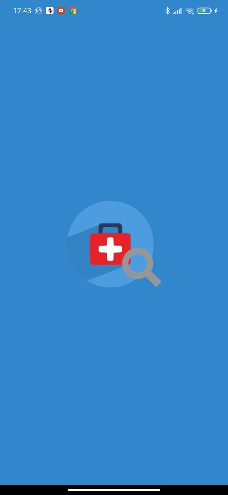
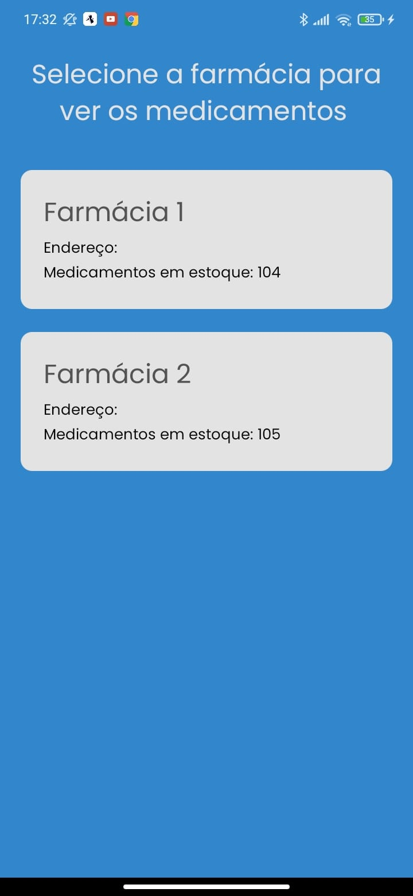
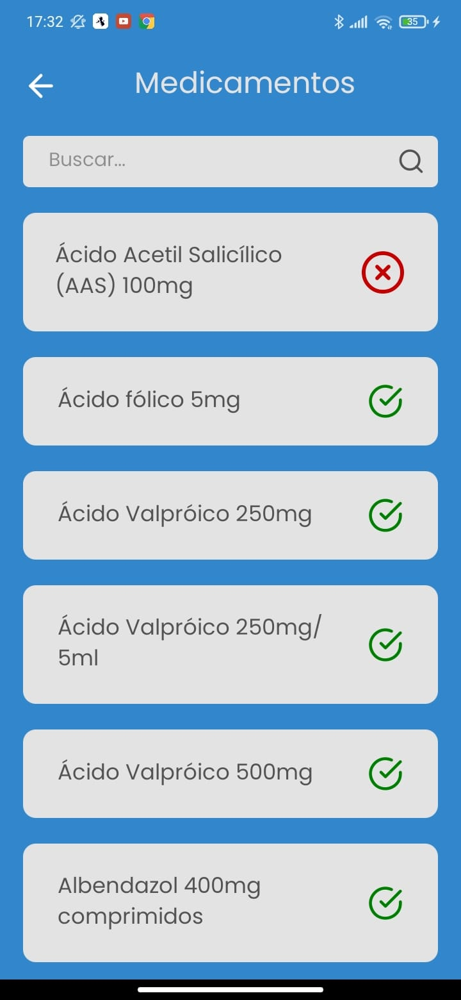
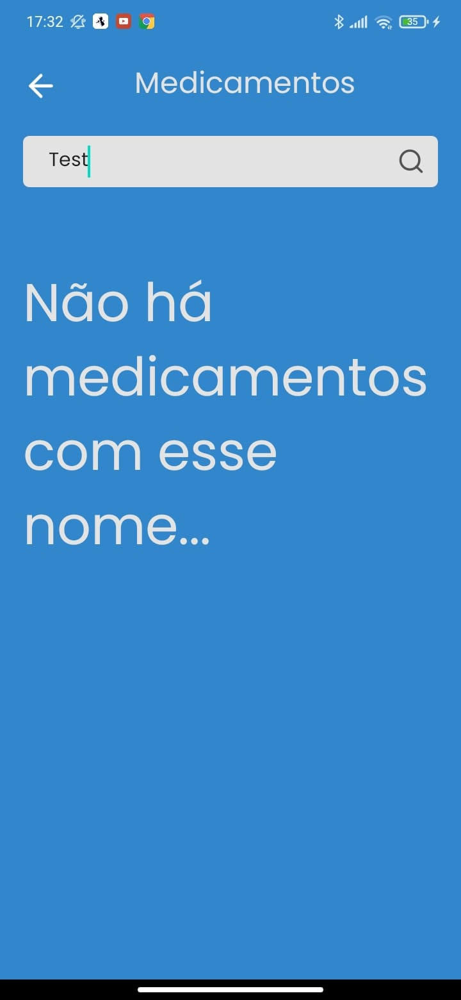

<h1 align="center">
    
</h1>

<h1 align="center">
    Drugstores
</h1>

<p align="center">
	<a href="#-tecnologias">Tecnologias</a>&nbsp;&nbsp;&nbsp;|&nbsp;&nbsp;&nbsp;
	<a href="#-projeto">Projeto</a>&nbsp;&nbsp;&nbsp;|&nbsp;&nbsp;&nbsp;
	<a href="#instalação">Instalação</a>&nbsp;&nbsp;&nbsp;|&nbsp;&nbsp;&nbsp;
	<a href="#instalação">Exemplo</a>
</p>

## 🚀 Tecnologias
Esse projeto foi desenvolvido com as seguintes tecnologias:
- [Django](https://www.djangoproject.com/)
- [Django-Rest-Framework](https://www.django-rest-framework.org/)
- [Next.js](https://nextjs.org/)
- [React Native](https://reactnative.dev/)
- [Expo](https://expo.io/)


## 💻 Projeto
**Projeto para cadastrar medicamentos, farmácias e colaboradores**


## Instalação
### Pré requisitos
Ter instalado:
- [Python](https://www.python.org/downloads/)
- [Node](https://nodejs.org/en/download/)
- [Yarn](https://classic.yarnpkg.com/en/docs/install/)
- [Expo](https://docs.expo.dev/get-started/installation/)


### Backend
```sh
# clonar repositório
git clone https://github.com/andre23arruda/drugstores

# Entrar na pasta
cd backend

# Renomear env_example.py para env.py
cp setup/env_example.py setup/env.py

# Criar um ambiente virtual
python -m venv venv

# Ativar o ambiente virtual
. activate.sh
# ou . venv/Scripts/activate
# ou . venv/bin/activate
# ou source venv/Scripts/activate

# Instalar os pacotes necessários
pip install -r requirements.txt

# Executar as migrações
python manage.py migrate

# Criar superusuário (poderá fazer login e entrar no admin)
. create_su.sh
# username -> teste
# password -> teste1234

# Carregar fixtures (exemplo para colocar no banco de dados)
python manage.py loaddata medicines groups

# Start
. run.sh
```

### Web
```sh
# Entrar na pasta
cd web_next

# Renomear .env_example para .env
cp .env_example.local .env.local

# Instalar os pacotes do projeto
yarn install

# Rodar
yarn start
```

### Mobile
```sh
# Entrar na pasta
cd mobile

# Instalar os pacotes do projeto
yarn install

# Rodar
expo start
```

### Rodar expo no celular
- Abrir expo no celular
- Ler QR code e executar o app


## Exemplo
<div align="center">
    
    
    
    
</div>
<hr>
